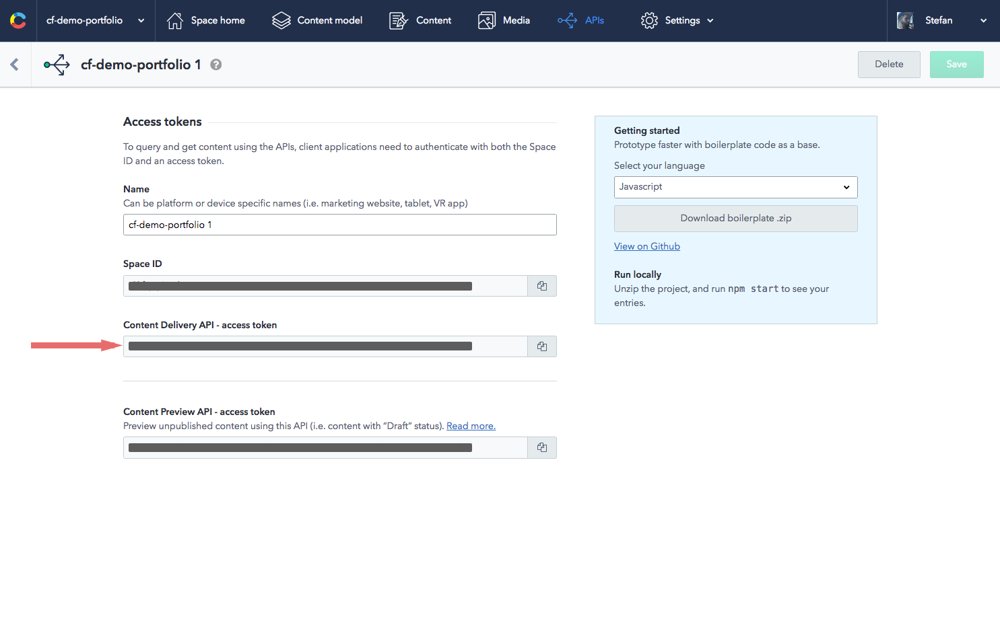

# Gettings started

To get you started you have to be registered at [Contentful](https://www.contentful.com).

## Clone the repo and install dependencies

```bash
$ git clone git@github.com:stefanjudis/contentful-blog-in-5-min.git

$ npm install
```

## Get needed config data from Contentful

To set up and use a new space you have to perform the following steps.

### Create a new space


### Create a Content Management API token


### Create a Content Delivery API token




## Import data in your newly created space

To import the content model and data you can use a tool from the Contentful ecosystem - [contentful-import](https://www.npmjs.com/package/contentful-import). This tool allows you to set up a new space with before exported data. It requires at least a Content Management API token and the id of the space that should be filled with data.

To make it not necessary to install contentful-import globally it's defined as a development dependency which means that you can use it via an npm scripts command. Run `npm run import-data` with the additional parameters.

*Side note: `--` is needed hand npm scripts arguments over to the actual command*

```bash
$ npm run import-data -- --space-id YOUR_SPACE_ID --management-token YOUR_MANAGEMENT_TOKEN
```

## Create a config file

Now that you have the Contentful setup done it's time set the configuration to run the project. To make this project run locally you have to create a `.contentful.js` in the root of the directory. You can find a `.contentful.sample` file which shows you what you have to define.

Needed config data:
- the ID of the space where your data lives
- the CDA access token so that you can fetch the data

```javascript
module.exports = {
  CTF_PERSON_ID: '15jwOBqpxqSAOy2eOO4S0m', // no need to be changed - was set in your import
  CTF_BLOG_POST_TYPE_ID: 'blogPost',       // no need to be changed - was set in your import
  CTF_SPACE_ID: 'YOUR_SPACE_ID',
  CTF_ACCESS_TOKEN: 'YOUR_DELIVERY_ACCESS_TOKEN'
};
```

## Preview your the site

To see the site working with your newly created data all you have to do is to run `npm run dev`. This command starts a server at `localhost:3000`.

## Deploy the site to `now`

`now` is a fairly new service by [zeit](https://zeit.co), which also provides static hosting. If you run `npm run deploy` you're asked for your email adress (which you have to confirm) once and then your site will find its way into the cloud.

```bash
$ npm run deploy
```

